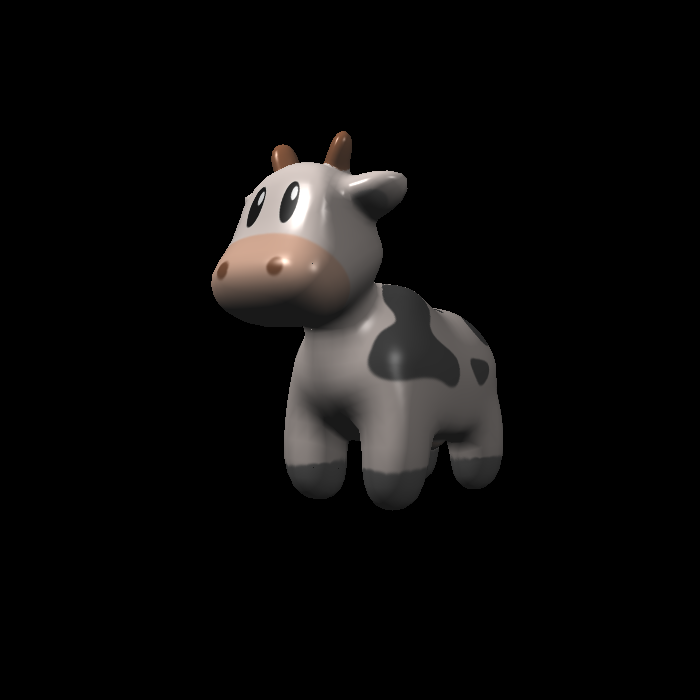
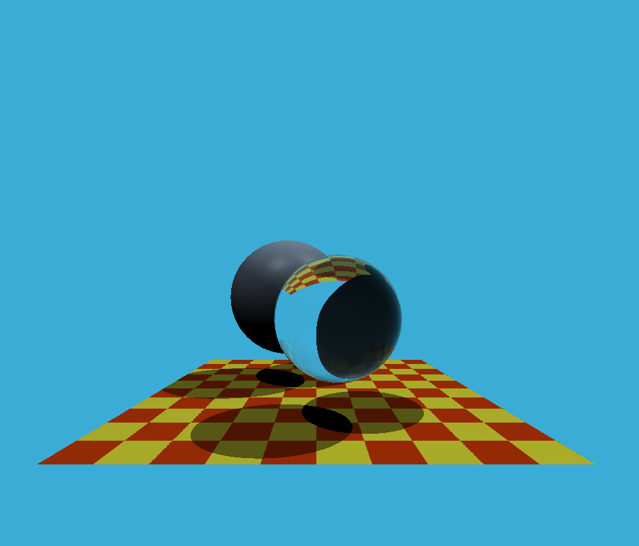
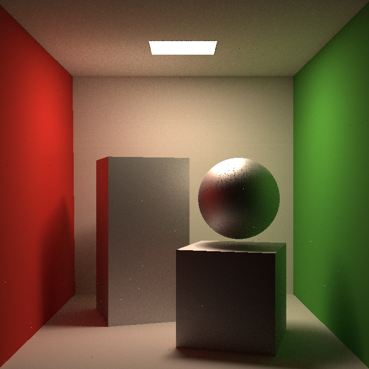

# GAMES101
My solutions to GAMES101: Introduction to Computer Graphics. 🎨
<figure class="pic">
    
    
    
</figure>

| Assignment     | Content |
| ----------- | ----------- |
| Assignment0      |  Development environment configuration. |
| Assignment1      |  Implement the MVP transformation matrix. (**Bonus:** Implement Rodrigues’ rotation formula)|
| Assignment2      |  Implement the Triangle Rasterization algorithm including depth interpolation and depth buffer. (**Bonus:** Use super-sampling to realize anti-aliasing)|
| Assignment3      |  Implement the Blinn-Phong model. Use several shaders to visualize texture, bump and displacement.  (**Bonus:** Use bilinear interpolation to sample texture)|
| Assignment4      |  Implement the de Casteljau algorithm to draw Bézier curve.  (**Bonus:** Implement the anti-aliasing of the curve)|
| Assignment5      |  Generate eye ray and use Möller Trumbore algorithm to calculate ray intersection with triangle mesh.
| Assignment6      |  Implement the Whitted-Style Ray Tracing algorithm. Judge whether a specific ray intersects with a bounding box and use BVH algorithm to speed up the process of judging.  (**Bonus:** Use SAH algorithm instead)|
| Assignment7      |  Implement the Path Tracing algorithm.  (**Bonus:** Support multi-threading and use Microfacet material)|
| Assignment8      |  Use explicit/semi-implicit Euler method and explicit Verlet method to simulate a Mass Spring System. The damping is also introduced. |